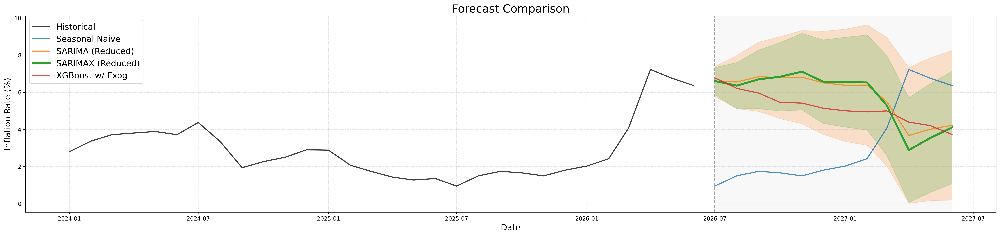

# Philippine Inflation Rate Forecasting

A time series forecasting project that analyzes and predicts the monthly year-on-year Philippine inflation rate using baseline, statistical, and machine learning models. The project covers data preparation, exploratory data analysis (EDA), feature engineering, model evaluation, and multi-step forecasting under the assumption that future exogenous variables are unknown.

## Forecast Preview

A comparison of the forecasts generated by the baseline, statistical, and machine learning models.

<p align="center">
  
</p>


## Installation

This project was developed and tested using **Python 3.9.13**.

### Clone the repository

```bash
git clone https://github.com/xxtofff/Inflation-Forecasting.git
cd Inflation-Forecasting
```

### Create a virtual environment

**Windows**

```bash
python -m venv .venv
.venv\Scripts\activate
```

**Linux/macOS**

```bash
python3 -m venv .venv
source .venv/bin/activate
```

### Install dependencies

```bash
pip install -r requirements.txt
```

## Quick Start

Run the notebooks in the following order:

1. `01_data_preparation.ipynb`
2. `02_eda.ipynb`
3. `03_naive.ipynb`
4. `04_sarima.ipynb`
5. `05_xgboost.ipynb`

Forecast outputs are saved to `outputs/forecasts/`, while generated figures are stored in `outputs/figures/`.

## Project Structure

```
.
├── data
│   ├── processed
│   │   └── combined_macro_data.csv
│   └── raw
│       ├── bsp_cpibase2018_dataset.csv
│       ├── global_dubai_crude.csv
│       ├── psa_unemployment_rate.csv
│       ├── target_rrp.csv
│       └── usd_to_php.csv
├── notebooks
│   ├── 01_data_preparation.ipynb
│   ├── 02_eda.ipynb
│   ├── 03_naive.ipynb
│   ├── 04_sarima.ipynb
│   ├── 05_xgboost.ipynb
│   └── 06_report.ipynb
├── outputs
│   ├── figures
│   │   ├── YoY_Inf_Rate.png
│   │   ├── YoY_Inf_Rate_Hist.png
│   │   ├── exog_red_forecast.jpg
│   │   ├── exog_red_forecast.png
│   │   ├── forecast_comparison.jpg
│   │   ├── forecast_comparison.png
│   │   ├── naive_forecast.jpg
│   │   ├── naive_forecast.png
│   │   ├── nexog_full_forecast.jpg
│   │   ├── nexog_full_forecast.png
│   │   ├── nexog_red_forecast.jpg
│   │   ├── nexog_red_forecast.png
│   │   ├── xgboost_forecast.jpg
│   │   └── xgboost_forecast.png
│   └── forecasts
│       ├── full_nexog_forecast.csv
│       ├── naive_forecast.csv
│       ├── red_exog_forecast.csv
│       ├── red_nexog_forecast.csv
│       ├── seasonal_naive_forecast.csv
│       ├── xgboost_exog_forecast.csv
│       ├── xgboost_full_nexog_forecast.csv
│       └── xgboost_red_nexog_forecast.csv
├── src
│   └── models
│       ├── naive.py
│       ├── sarima.py
│       └── xgboost.py
└── README.md
```

## Workflow

1. **Data Preparation**

   * Clean and merge macroeconomic datasets.
   * Generate the processed dataset used for modeling.

2. **Exploratory Data Analysis**

   * Visualize inflation trends.
   * Examine rolling averages and the distribution of inflation.

3. **Forecasting**

   * **Naive and Seasonal Naive** as baseline forecasting models.
   * **SARIMA/SARIMAX** for classical time series forecasting.
   * **XGBoost** for machine learning-based forecasting using engineered macroeconomic features.

4. **Outputs**

   * Generate forecast visualizations.
   * Export forecast results as CSV files for further analysis.

## Data Sources

* Bangko Sentral ng Pilipinas (BSP)
* Philippine Statistics Authority (PSA)
* Dubai Fateh Crude Oil Spot Price Data