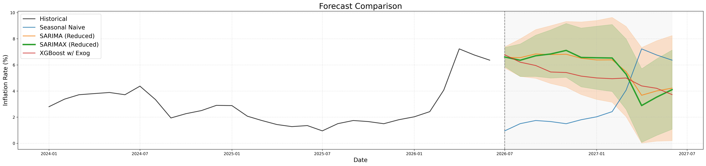

# Philippine Inflation Rate Forecasting

A time series forecasting project that predicts the monthly year-on-year Philippine inflation rate using baseline, statistical, and machine learning models. The project covers data preparation, exploratory data analysis (EDA), feature engineering, model evaluation, and multi-step forecasting. When future macroeconomic variables are unavailable, exogenous variables are forecast recursively before being used for inflation forecasting.

## Forecast Preview

Comparison of the twelve-month forecasts produced by the baseline, statistical, and machine learning models.

<p align="center">
  
</p>

## Results

Forecasting performance on the hold-out test set.

| Model | RMSE ↓ | MAE ↓ | R² ↑ |
|:------|--------:|-------:|------:|
| Naive | 2.864 | 1.882 | -0.670 |
| Seasonal Naive | 3.065 | 2.332 | -0.913 |
| SARIMA (Full) | 2.459 | 1.707 | -0.231 |
| SARIMA (Red) | 2.273 | 1.484 | -0.052 |
| **SARIMAX** | **1.511** | **1.053** | **0.535** |
| XGBoost (Full) | 2.385 | 1.473 | -0.158 |
| XGBoost (Red) | 2.834 | 1.837 | -0.635 |
| XGBoost (Red w/ Exog) | 2.842 | 1.873 | -0.644 |

The SARIMAX model achieved the lowest RMSE and MAE while also obtaining the highest coefficient of determination (R²) on the hold-out test set. Among the evaluated models, it provided the most accurate forecasts for the available data.

## Installation

This project was developed and tested using **Python 3.9.13**.

### Clone the repository

```bash
git clone https://github.com/xxtofff/Inflation-Forecasting.git
cd Inflation-Forecasting
```

### Create a virtual environment

**Windows**

```bash
python -m venv .venv
.venv\Scripts\activate
```

**Linux/macOS**

```bash
python3 -m venv .venv
source .venv/bin/activate
```

### Install dependencies

```bash
pip install -r requirements.txt
```

## Quick Start

Run the notebooks in the following order. Each notebook builds on outputs produced by the previous steps.

1. `01_data_preparation.ipynb`
2. `02_eda.ipynb`
3. `03_naive.ipynb`
4. `04_sarima.ipynb`
5. `05_xgboost.ipynb`
6. `06_report.ipynb`

Forecast CSV files are saved to `outputs/forecasts/`, while generated figures are saved to `outputs/figures/`.

## Project Structure

```text
.
├── data
│   ├── processed
│   │   └── combined_macro_data.csv
│   └── raw
│       ├── bsp_cpibase2018_dataset.csv
│       ├── global_dubai_crude.csv
│       ├── psa_unemployment_rate.csv
│       ├── target_rrp.csv
│       └── usd_to_php.csv
├── notebooks
│   ├── 01_data_preparation.ipynb
│   ├── 02_eda.ipynb
│   ├── 03_naive.ipynb
│   ├── 04_sarima.ipynb
│   ├── 05_xgboost.ipynb
│   └── 06_report.ipynb
├── outputs
│   ├── figures
│   │   ├── YoY_Inf_Rate.png
│   │   ├── YoY_Inf_Rate_Hist.png
│   │   ├── exog_red_forecast.jpg
│   │   ├── exog_red_forecast.png
│   │   ├── forecast_comparison.jpg
│   │   ├── forecast_comparison.png
│   │   ├── naive_forecast.jpg
│   │   ├── naive_forecast.png
│   │   ├── nexog_full_forecast.jpg
│   │   ├── nexog_full_forecast.png
│   │   ├── nexog_red_forecast.jpg
│   │   ├── nexog_red_forecast.png
│   │   ├── xgboost_forecast.jpg
│   │   └── xgboost_forecast.png
│   └── forecasts
│       ├── full_nexog_forecast.csv
│       ├── naive_forecast.csv
│       ├── red_exog_forecast.csv
│       ├── red_nexog_forecast.csv
│       ├── seasonal_naive_forecast.csv
│       ├── xgboost_exog_forecast.csv
│       ├── xgboost_full_nexog_forecast.csv
│       └── xgboost_red_nexog_forecast.csv
├── src
│   └── models
│       ├── naive.py
│       ├── sarima.py
│       └── xgboost.py
├── README.md
└── requirements.txt
```

## Workflow

1. **Data Preparation**

   * Clean and merge the inflation and macroeconomic datasets.
   * Create a processed dataset for exploratory analysis and forecasting.

2. **Exploratory Data Analysis**

   * Examine long-term inflation behaviour.
   * Visualize the distribution, seasonality, and rolling statistics of the inflation rate.

3. **Forecasting**

   * **Naive** and **Seasonal Naive** provide baseline forecasts.
   * **SARIMA/SARIMAX** models are selected using `auto_arima` and evaluated with expanding-window time series cross-validation. When exogenous variables are required but unavailable, they are forecast recursively before generating inflation forecasts.
   * **XGBoost** uses lag features, rolling statistics, cyclical calendar features, hyperparameter optimization with `RandomizedSearchCV`, SHAP-based feature selection, and expanding-window time series cross-validation. Recursive forecasting is also used when future exogenous variables are unavailable.

4. **Reporting**

   * Compare forecasting performance across models.
   * Generate forecast figures.
   * Save forecast results as CSV files.

## Model Evaluation

Models are evaluated using expanding-window time series cross-validation together with a final hold-out test set. Performance metrics reported in the project include RMSE, MAE, and, where applicable, R². Baseline, statistical, and machine learning models are evaluated using the same forecasting horizon for comparison.

## Data Sources

* Bangko Sentral ng Pilipinas (BSP)
  * Consumer Price Index
  * Target Reverse Repurchase (RRP) Rate
  * USD/PHP Exchange Rate
* Philippine Statistics Authority (PSA)
  * Unemployment Rate
* Dubai Fateh Crude Oil Spot Price
